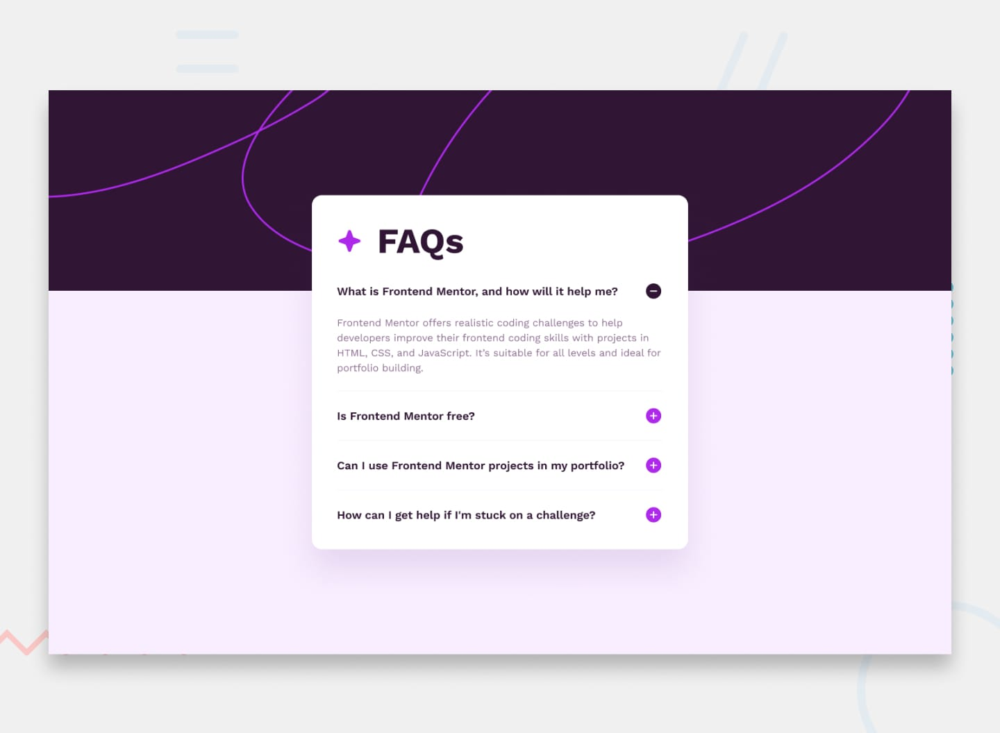

# Frontend Mentor - FAQ accordion solution

This is a solution to the [FAQ accordion challenge on Frontend Mentor](https://www.frontendmentor.io/challenges/faq-accordion-wyfFdeBwBz). Frontend Mentor challenges help you improve your coding skills by building realistic projects. 

## Table of contents

- [Overview](#overview)
  - [The challenge](#the-challenge)
  - [Screenshot](#screenshot)
  - [Links](#links)
- [My process](#my-process)
  - [Built with](#built-with)
  - [What I learned](#what-i-learned)
  - [Continued development](#continued-development)
  - [Useful resources](#useful-resources)
- [Author](#author)
- [Acknowledgments](#acknowledgments)


## Overview

### The challenge

Users should be able to:

- Hide/Show the answer to a question when the question is clicked
- Navigate the questions and hide/show answers using keyboard navigation alone
- View the optimal layout for the interface depending on their device's screen size
- See hover and focus states for all interactive elements on the page

### Screenshot




### Links

- Solution URL: (https://github.com/dd-boy22/faq-accordion.git)
- Live Site URL: (https://faq-accordion-ten-kohl.vercel.app/)

## My process

### Built with

- Semantic HTML5 markup
- CSS custom properties
- Flexbox
- Desktop-first workflow
- Javascript

### What I learned

This project helped me get more comfortable with JavaScript and DOM manipulation.

One of the main things I learned was how to use querySelectorAll() to select multiple elements and then use a for loop to add event listeners to each element.

I also learned how to use the same index to connect each question's plus icon to its corresponding answer.

```js
for (let i = 0; i < plusIcons.length; i++) { plusIcons[i].addEventListener('click', function () { if (answers[i].classList.contains('hidden')) { answers[i].classList.remove('hidden'); plusIcons[i].src = "/assets/images/icon-minus.svg"; } else { answers[i].classList.add('hidden'); plusIcons[i].src = "/assets/images/icon-plus.svg"; } }); }
```
I also learned how classList.contains(), classList.add(), and classList.remove() can be used to control the visibility of elements.

### Continued development

I want to continue improving my JavaScript fundamentals, especially DOM manipulation and handling user interactions.

I also want to get more comfortable with making websites fully accessible, including keyboard navigation and focus states.


- Frontend Mentor - [@yourusername](https://www.frontendmentor.io/profile/yourusername)


